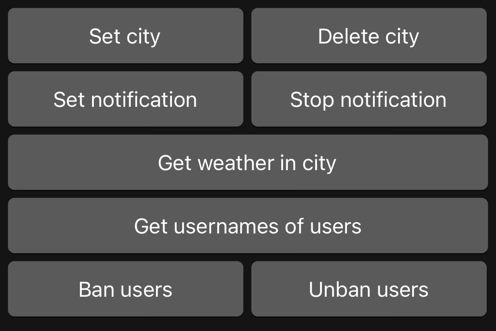

# **Лабораторные работы 3, 4**

Ссылка на докер-хаб: https://hub.docker.com/repository/docker/krishtapovich/weather_bot  
Бот: @KrishtapovichWeatherBot

Телеграм бот для получения погоды\
Функции:
1. Авторизация
2. Добавление / удаление города
3. Получение погоды
4. Установление / удаление уведомлений
5. Функции админа:
    - Просмотр всех пользователей
    - Бан пользователей (отлючает все функции)
    - Разбан
   
## Функции админа

## Функции обычного пользователя

## Добавление города

## Удаление города
Пользователь получает сообщение с inline кнопками,\
когда происходит удаление города, удаляется кнопка и приходит сообщение

## Получение погоды

## Установка и получение уведомления

## Удаление уведомления
Пользователь получает сообщение с inline кнопками,\
когда происходит удаление уведомления, удаляется кнопка и приходит сообщение

## Получение всех пользователей

## Неправильный ввод

## Бан пользователя

## Попытка возпользоваться ботом у забаненного пользователя

## Разбан пользователя
Админ получает сообщение с inline кнопками,\
когда происходит разбан пользователя, удаляется кнопка и приходит сообщение

